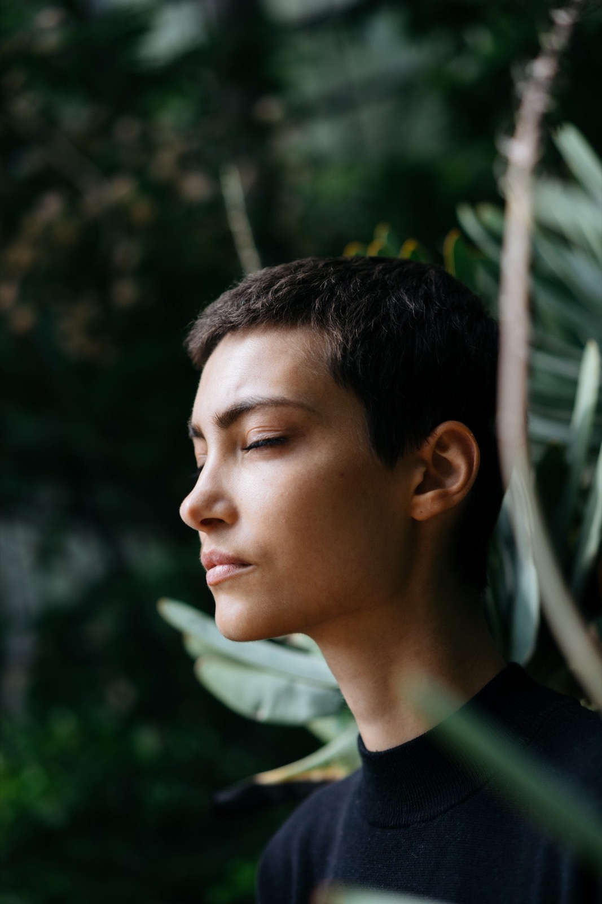

Dans cet article, je veux partager plus intimement le cheminement qui m’a menée vers l’acte le plus salvateur qu’il m’ait été donné d’expérimenter : habiter mon corps.

Quelles que soient les techniques thérapeutiques que j’étudie, les enseignements de méditation que je reçois ou les expérimentations que je traverse, je reviens toujours à mon ami le plus cher : mon corps, mes cellules, les sensations qui me traversent.

**Pourquoi est-il si difficile d’habiter son corps ?**

Comme pour beaucoup, cette capacité à habiter cet ami précieux fut davantage un parcours du combattant qu’un chemin doux et facile. C’est pour cela que te faire l’éloge de la présence me semble indispensable aujourd’hui.

Je mets cela sur le dos de notre conditionnement social à ne compter que sur le mental et à abandonner notre corps. Je l’avoue, j’ai un faible pour blâmer la société.

Mais cela peut aussi venir des traumatismes, qui poussent souvent à davantage de contrôle et à une perte de confiance envers le corps.

Tout le monde en parle.

Les thérapeutes spécialisés dans le trauma parlent de réguler le système nerveux.

Les professeurs de méditation parlent d’être en présence avec ce qui est.

Cela m’a pris du temps pour comprendre, entendre et accepter tout cela.

**Quand comprendre ne suffit plus**

Le nombre de fois où l’on m’a dit : « Tu n’as pas besoin de comprendre », et où je répondais : « Mais bien sûr que si ! »

C’est aussi pour cela que je comprends profondément les personnes que j’accompagne. Je ne suis pas différente.

Les défis que vous traversez, je les ai traversés et je les traverse encore, moi aussi.

La différence est simplement qu’aujourd’hui, ma pratique m’a offert une expérience et une compréhension du corps que je souhaite transmettre à toutes les personnes qui n’ont pas encore emprunté ce chemin.

Par peur. Par méconnaissance. Par résistance.

Car tout cela, je l’ai vécu également.

Encore aujourd’hui, une part de moi résiste parfois. Une part qui aime tout comprendre et tout disséquer. Une part qui veut faire sens de tout avant d’accepter de redescendre dans le corps, de s’habiter.

Quand j’ai commencé à méditer, je devais me forcer. Ce n’était pas une partie de plaisir. Pourtant, j’ai continué parce que j’observais des changements très progressifs.

Je faisais le minimum. Guidée.

Puis, après quelques années de pratique, mon corps a senti. Il s’est souvenu.

Ce chemin que j’emprunte chaque fois que je sens mon corps, c’est le chemin vers mon monde intérieur — d’où le nom de mon programme.

C’est celui que je peux emprunter chaque fois que je perds ma route, que je perds mon centre.

C’est celui qui, sans jamais m’en vouloir, me ramène chez moi : profondément ancrée en mon centre.

Parfois, j’aimerais utiliser un autre mot que « méditation ». Car méditation peut laisser croire qu’il s’agit d’une pratique, d’un hobby comme un autre.

Pour moi, c’est bien davantage.

On nous a enseigné à manger. À dormir. Mais on a oublié de nous dire d’habiter notre corps.

On a oublié de nous dire que s’habiter, être en soi chaque jour, est peut-être l’une des portes d’entrée vers une vie pleinement vécue, une vie incarnée.

Récemment, j’ai augmenté mon temps de méditation — ou plutôt mon temps d’habitation du corps.

De vingt minutes de pratique, je suis passée à une heure.

Cela peut paraître beaucoup.

Et pourtant, il me paraît aujourd’hui étonnant de passer vingt-trois heures de notre journée sans venir pleinement habiter, sentir et rencontrer notre être.

**Habiter son corps au quotidien**

Depuis que j’ai allongé mes méditations, quelque chose en moi se détend de plus en plus dans cette nouvelle manière d’habiter la vie.

Les stress du quotidien ont enfin l’espace d’être accompagnés, accueillis et traversés pendant ce temps d’habitation profonde.

Mon rapport au monde, ma présence à moi-même et aux autres s’en trouvent transformés.

Davantage de joie, de calme et de tranquillité se sont également installés.

Pourtant, le but de cette démarche n’a jamais été de devenir plus heureuse ou de vivre en paix.

Mon seul désir est d’habiter toujours un peu plus mon corps, afin de me recevoir moi-même et de recevoir le monde depuis cet espace.

Cela m’a pris plusieurs années pour ancrer ce niveau de confiance à l’intérieur de moi.

Et j’ai hâte de découvrir où ce chemin peut me mener.

Mais une chose a changé.

Désormais, mon savoir n’est plus seulement dans ma tête.

Il est profondément ancré dans mon corps.

Si cet article avait une humble intention, ce serait de vous inspirer, chacune d’entre vous, à essayer.

À revenir sentir votre maison.

À être AVEC plutôt que contre.

À être ici plutôt qu’ailleurs.

À habiter un peu plus pleinement ce corps qui vous accompagne depuis toujours.

Et si certaines questions émergent à propos de cette pratique ou de ce chemin, n’hésitez pas à m’écrire. Ce sera un plaisir d’échanger avec vous.

Et pour aller encore plus loin, [je propose deux accompagnements autour de la méditation](/masterclass/): Clique ici pour en savoir davantage ou écrit moi.
