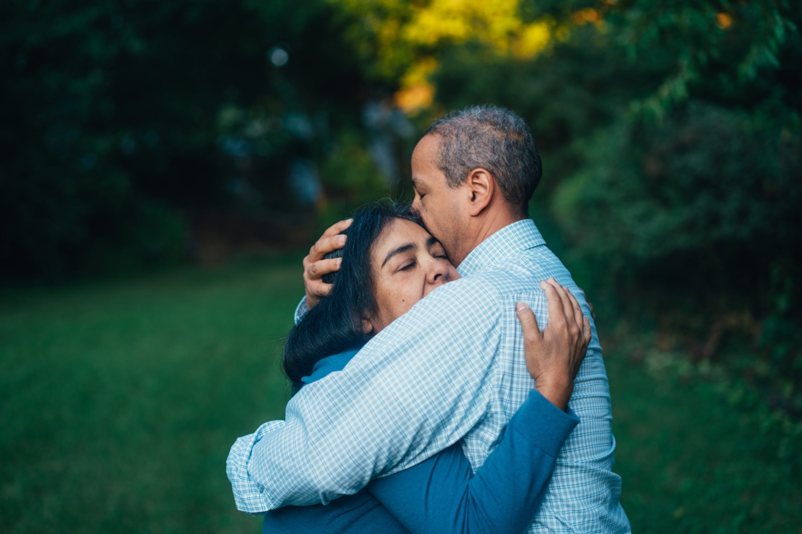

Les traumatismes laissent une empreinte durable sur notre psychisme. Ils influencent non seulement notre bien-être personnel, mais aussi la manière dont nous construisons nos relations amoureuses.  
En tant que psychologue clinicienne, j’accompagne des personnes dont les blessures du passé viennent impacter leurs liens affectifs.  
Dans cet article, découvrons comment un traumatisme affecte le couple, et comment il est possible de retrouver un lien plus sain et plus stable.

* * *

## **Comment le traumatisme influence nos relations ?**

### 🧠 Les modèles relationnels ancrés dans le passé

Les événements traumatiques peuvent créer des **schémas d’attachement** inconscients.  
Ces modèles influencent :

-   notre manière de créer du lien,
-   nos attentes envers l’autre,
-   notre manière d’exprimer nos émotions.

Par exemple, certains développent une **peur du rejet**, d’autres un besoin constant de réassurance.

👉 [À lire aussi : comprendre les styles d’attachement](/comment-te-relies-tu-aux-autres/)

## **Les effets du traumatisme sur la confiance et l’intimité**

### 💔 Des liens affectifs fragilisés

Après un traumatisme, il devient parfois difficile de faire confiance.  
Certaines personnes se protègent en gardant leurs distances. D’autres, au contraire, deviennent très dépendantes de l’affection de leur partenaire.

Ces réactions sont souvent **inconscientes**, mais elles compliquent la relation de couple.

* * *

## **Communication difficile et émotions bloquées**

### 🗣 Des échanges altérés

Les personnes traumatisées peuvent avoir du mal à parler de ce qu’elles ressentent.  
La peur de ne pas être comprises ou la crainte du conflit limitent souvent la communication.

Résultat : des besoins émotionnels non exprimés, des malentendus et parfois de la frustration des deux côtés.

* * *

## **Quand le passé ressurgit dans le présent**

### ⚡️ La réactivation des blessures anciennes

Certains gestes, mots ou situations peuvent raviver des souvenirs douloureux.  
Ces **déclencheurs émotionnels** peuvent provoquer des réactions fortes et inattendues.

Par exemple :

-   colère soudaine,
-   repli sur soi,
-   panique ou anxiété.

Cela peut perturber l’harmonie du couple, surtout si le partenaire ne comprend pas la source de ces émotions.

* * *

## **Comment se reconstruire à deux après un traumatisme ?**

### 🌱 1. Communiquer avec sincérité

Une communication ouverte et respectueuse est essentielle. En effet, parler de ses besoins, de ses limites ou de ses peurs permet de créer un espace de sécurité émotionnelle. Ce cadre bienveillant facilite l’intimité et la confiance.

### 💛 2. Pratiquer la compassion et la patience

La guérison n’est pas linéaire. Elle demande du temps, de la douceur et de la compréhension.  
Ainsi, soutenir son partenaire tout en se respectant soi-même est une posture clé pour renforcer la relation.

### 🧑‍⚕️ 3. Se faire accompagner par un professionnel

Dans de nombreux cas, l’aide d’un thérapeute est précieuse.  
Une **thérapie individuelle** ou **de couple** permet d’explorer les mécanismes à l’œuvre et de se libérer des schémas répétitifs. L’EMDR, par exemple, peut être une méthode efficace pour traiter les traumatismes.

👉 [Découvrir l’EMDR, une méthode efficace pour traiter les traumatismes](/therapie-emdr/)  
👉 [Me contacter pour un accompagnement thérapeutique](https://www.doctolib.fr/psychologue/l-etang-sale/benedicte-donet)

* * *

## **Conclusion : une relation peut devenir un espace de guérison**

Les traumatismes n’empêchent pas d’aimer ou d’être aimé. Cependant, ils demandent à être reconnus et accompagnés.  
Grâce à une communication sincère, une compréhension mutuelle et un travail sur soi, il est possible de reconstruire des relations solides et apaisées.

En tant que psychologue clinicienne, je vous accompagne dans ce processus avec bienveillance et engagement.

* * *
