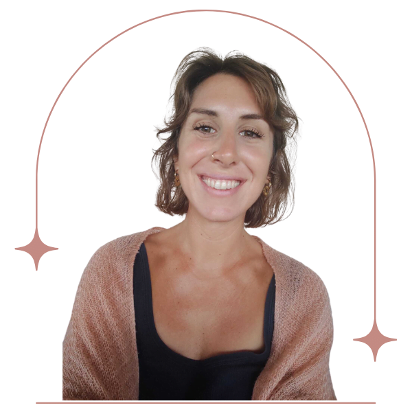
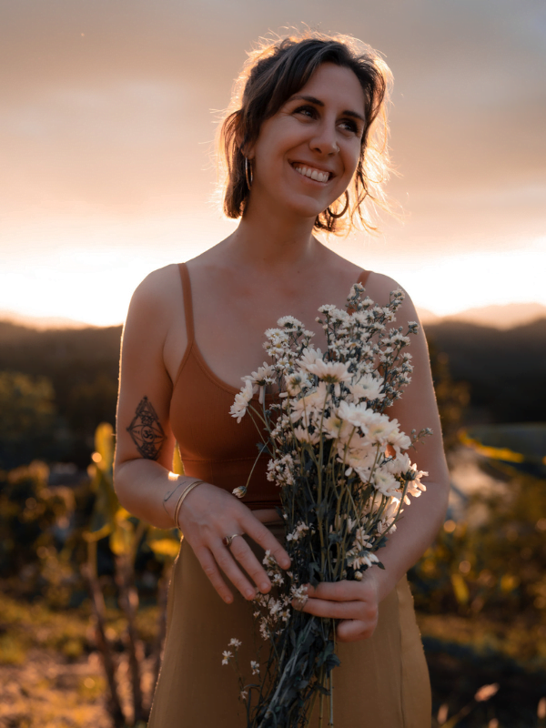

## Who am I?

Since my earliest years, humanity has fascinated me.  
Growing up in a family of caregivers, I was moved and inspired to **approach healing in a holistic way**, welcoming the mental, emotional, physical, and energetic dimensions of care.  
This openness allowed me to understand the links between Western and Eastern approaches, and the impact of methods ranging from the most holistic to the most conventional.

Observing, understanding, feeling, and caring have been an integral part of my journey. The desire to support others naturally led me towards the study of psychology.  
Continuously, I am committed to learning and experimenting in order to **offer the most attentive and effective approach for each person**.  
This journey is nourished by my training, encounters, reading, and life experiences. I am also guided by my intuition to accompany you with the greatest sensitivity.  
Thus, my practice naturally weaves together different approaches to support a caring and transformative space.  
A lover of inner journeys, I enjoy exploring **different therapeutic modalities drawn from ancestral traditions** and enriching my practice with these discoveries.  
The way I support you is therefore infused with this unique path, meeting your sensitivity.

[Discover my practices](/en/services/)

## My journey

At 25, freshly out of university with my **clinical psychologist** degree in hand, I entered working life, passionate and motivated.

I love supporting children and adolescents, but I was disappointed by the framework of the French national education system. I observed with sadness the limits of what I could offer within short sessions and a strict institutional approach.

This led me to discover meditation (MBSR), **transforming my relationship with the world** and opening me towards greater presence.

During a **silent meditation retreat**, I made the decision to leave my job to explore a more grounded and sensitive approach to accompaniment.

On this path, the more I deepened this connection with my inner world, the more I felt an indescribable joy.  
This was followed by an exploration of **yoga**, meditation, **family constellations**, and then **feminine sexuality** through my encounters with Asia and South America.  
I then decided to explore these new teachings in depth, passed on to me by women full of wisdom.  
In Thailand, I finally deepened my knowledge of **trauma**, post-traumatic stress, and memory.  
This became a passion that led me to train in **EMDR** and IEMT.

Today, this journey between clinical psychology, scientific research, and my practice of yoga, meditation, and the **sacred feminine** allows me to offer support that nurtures every part of your being and your experience.

What I offer you in my practice as a psychologist, I have explored deeply in my personal work and in my training.

I am now passionate about the idea of passing on this knowledge, practices, and teachings in different forms: individual sessions, workshops, and retreats.

[Book my session](https://www.doctolib.fr/psychologue/l-etang-sale/benedicte-donet?fbclid=IwZXh0bgNhZW0CMTAAAR1i9xzKjnpEu4CYAdKrMjOT29-pjttCgck6O0WvVdrZELEQWLEK59NJcnw_aem_AbGEMI5CdusHS4yKDj6GJEo_APfV_1INRdpW1Bs_gRwVQEzXL8cXo6BsdC98g6Rq2LZMFWFqn1TYoTsTeAiwPWGz)

Happiness is not acquired; it does not reside in appearances. Each of us builds it at every moment of our life with our heart.

African proverb

## My training path

-   A degree in psychology: social, developmental, clinical, cognitive — Paul Valéry, Montpellier, 2012
-   A Master's in clinical psychology and psychopathology, phenomenological orientation — Paul Valéry, Montpellier, 2015
-   Perinatal training, Montpellier, 2016
-   Mindfulness training, Mindfulness-Based Stress Reduction with Thomas John Doucence — Montpellier, 2017
-   Yoga teacher training, Pyramid Yoga Center, Thailand, 2019
-   Blissschool feminine sexuality training, Thailand, 2020
-   Layla Martin sexuality, love and relationship coaching training, remote, 2021
-   EMDR remote training with Australian trainer, 2022
-   Breath and breathing training, Thailand, 2022
-   Incest, abuse and sexual trauma training, remote, 2022
-   IEMT training, Integral Eye Movement Therapy, remote, 2023

## My academic research

-   From the voice of climbing to the symbolic path: follow-up of an autistic child in a climbing workshop, 2014
-   Spatio-temporality of crisis: from a suspended existence to spontaneity — proposal for a theatre workshop, 2015
