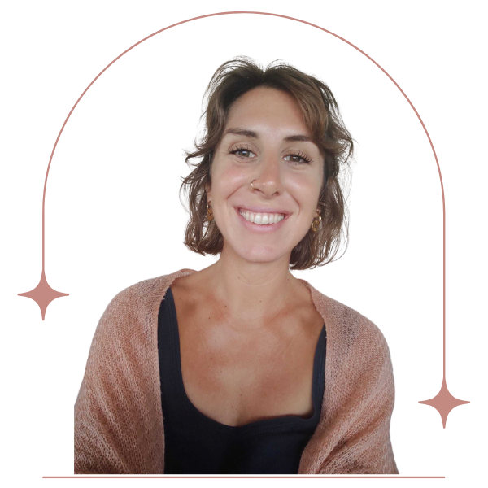

## Qui suis-je ?

Depuis mon plus jeune âge, l’humanité m’a fasciné.  
En grandissant au sein d’une famille de soignants, j’ai été touché et inspiré à **appréhender la guérison de manière holistique**, accueillant les aspects mentaux, émotionnels, physiques et énergétiques du soin.  
Cette ouverture m’a permis de comprendre les liens entre l’approche occidental et oriental, et l’impact de méthodes allant des plus holistiques aux plus conventionnelles.

Observer, comprendre, ressentir et prendre soin ont fait partie intégrante de mon cheminement. L’envie de soutenir m’a naturellement orientée vers l’étude de la psychologie.  
Continuellement, j’ai à cœur d’apprendre et d’expérimenter afin d’**offrir l’approche la plus attentionnée et efficace pour chacun**.  
Ce voyage est nourri par mes formations, rencontres, lectures ainsi que mes expériences de vie. Je suis également guidée par mon intuition pour vous accompagner avec le plus de justesse.  
Ainsi, ma pratique entrelace naturellement différentes approches afin de soutenir un espace bienveillant et transformatif.  
Amoureuse des voyages dans l’âme, j’aime expérimenter **différentes modalités thérapeutiques venues de traditions ancestrales** et nourrir ma pratique de ces découvertes.  
Ainsi, ma manière de vous soutenir est imprégnée de ce parcours singulier à la rencontre de votre sensibilité.

[Découvrir mes pratiques](/services/)

## Mon cheminement

A 25 ans, fraîchement sortie de l’université, mon diplôme de **psychologue clinicienne** en poche, je rentre dans la vie active, passionnée et motivée.

J’aime accompagner les enfants et les adolescents, mais je suis déçue par le cadre de l’éducation nationale. J’observe avec tristesse la limite de ce que je peux offrir sur des temps courts et une approche institutionnelle stricte.

Cela m’a mené vers la découverte de la méditation (mbsr), **transformant mon rapport au monde** et m’ouvrant vers plus de présence.

Lors d’une retraite de **méditation en silence**, je prends la décision de quitter mon travail pour partir à la découverte d’une approche plus ancrée et sensible de l’accompagnement.

Sur ce chemin, plus j’approfondis cette connexion avec mon monde intérieur, plus je ressens une joie indescriptible.  
S’ensuit une exploration du **yoga**, de la méditation, de la **constellation familiale** puis de la **sexualité féminine** au fil de mes rencontres avec l’Asie et l’Amérique du sud.  
Je décide alors d’explorer profondément ces nouveaux enseignements que des femmes pleines de sagesse me transmettent.  
En Thaïlande, j’approfondis finalement ma connaissance du **traumatisme**, du stress post traumatique et de la mémoire.  
Cela devient une passion qui me pousse à me former à l’**EMDR** et l’IEMT.

Aujourd’hui, ce cheminement entre psychologie clinique, recherches scientifiques et ma pratique du yoga, de la méditation et du **féminin sacré** me permettent d’offrir un accompagnement qui soutient chaque part de votre être et de votre expérience.

Ce que je vous offre dans ma pratique de psychologue, je l’ai profondément exploré dans mon travail personnel et dans mes formations.

Je suis maintenant passionnée par l’idée de vous transmettre ces savoirs, pratiques, enseignements sous différentes formes : séances individuelles, ateliers, retraites.

[Je réserve ma séance](https://www.doctolib.fr/psychologue/l-etang-sale/benedicte-donet?fbclid=IwZXh0bgNhZW0CMTAAAR1i9xzKjnpEu4CYAdKrMjOT29-pjttCgck6O0WvVdrZELEQWLEK59NJcnw_aem_AbGEMI5CdusHS4yKDj6GJEo_APfV_1INRdpW1Bs_gRwVQEzXL8cXo6BsdC98g6Rq2LZMFWFqn1TYoTsTeAiwPWGz)

Le bonheur ne s’acquiert pas, il ne réside pas dans les apparences, chacun d’entre nous le construit à chaque instant de sa vie avec son cœur.

Proverbe africain

## Mon parcours de formation

-   Une licence en psychologie : sociale, développement, clinique, cognitive - Paul Valery, Montpellier, 2012
-   Un Master en psychologie clinique et psychopathologie orientation phénoménologique - Paul Valery, Montpellier, 2015
-   Formation en périnatalité, Montpellier, 2016
-   Formation pleine conscience, Mindfulness-based stress reduction avec Thomas John Doucence - Montpellier, 2017
-   Formation de professeur yoga, Pyramid yoga center, Thaïlande, 2019
-   Formation Blissschool sexualité féminine, Thaïlande, 2020
-   Formation Layla Martin coach sexualité, amour et relation à distance, 2021
-   Formation EMDR à distance formateur australien, 2022
-   Formation souffle et respiration, Thaïlande, 2022
-   Formation inceste, abus et trauma sexuels, à distance, 2022
-   Formation IEMT, Integral Eye Movement Therapy, à distance, 2023

## Mes recherches universitaires

-   De la voix d’escalade à la voie symbolique : suivi d’un enfant autiste en atelier escalade, 2014
-   Spatio-temporalité de la crise : d’une existence suspendue à la spontanéité proposition d’un atelier théâtrale, 2015
