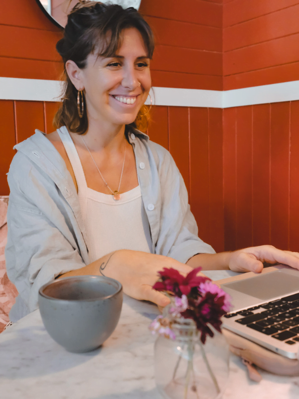

## Prise de rendez-vous

La prise de rendez-vous se fait par email ou par le lien de contact [ci-dessous](#form).

-   Les séances ont une durée de **1h30** pour que vous ayez le temps de partager, vous déposer et cheminer.  
      
    
-   Le nombre de séances dépend de ce que vous souhaitez travailler lors de celles-ci, ainsi que de votre sensibilité.  
      
    
-   Les séances sont uniquement en téléconsultation. Bien qu’une adresse soit enregistrée sur ma page Google, celle-ci n’est pas l’adresse d’un cabinet.  
      
    
-   Si je n’ai pas de disponibilité à vous proposer avant plusieurs mois, je vous proposerai de vous orienter vers un autre professionnel de confiance.

[Je réserve ma séance](https://www.doctolib.fr/psychologue/l-etang-sale/benedicte-donet?fbclid=IwZXh0bgNhZW0CMTAAAR1i9xzKjnpEu4CYAdKrMjOT29-pjttCgck6O0WvVdrZELEQWLEK59NJcnw_aem_AbGEMI5CdusHS4yKDj6GJEo_APfV_1INRdpW1Bs_gRwVQEzXL8cXo6BsdC98g6Rq2LZMFWFqn1TYoTsTeAiwPWGz)

## Informations importantes

-   Je ne participe pas au parcours « Mon soutien psy ». Vous ne pouvez donc pas vous faire rembourser les séances dans ce cadre précis.
-   En revanche, en dehors de ce dispositif, certaines **mutuelles** vous permettront d’obtenir un remboursement sur un certain nombre de séances. N’hésitez donc pas à contacter votre mutuelle pour lui demander. Si celle-ci vous propose des remboursements, précisez-le-moi au préalable pour que je vous envoie une facture lors de chacune de nos séances.
-   Je suis ouverte à travailler auprès d’adolescents mineurs **à partir de 13 ans**, seulement sous condition que l’adolescent souhaite, par lui-même, recevoir des séances.
-   Quelle que soit ton orientation sexuelle et/ou ton idée de genre, tu es le/la bienvenu/e. Je me sensibilise et me forme autant que possible pour offrir un **espace sécurisant** et accueillant pour tous. Je suis aussi ouverte à évoluer et à apprendre de mes patients.

Si vous avez d’autres interrogations, je serai heureuse de vous répondre par le [formulaire de contact](#form) ou par [email](<mailto: donetbenedicte@gmail.com>).

Prenez bien soin de vous.  
Bénédicte Donet

Pour me contacter :

-   [+33 6 17 78 98 78](tel:0033617789878)
-   [donetbenedicte@gmail.com](mailto:donetbenedicte@gmail.com%20)
-   Téléconsultation sur Zoom

## Je passe à l’action

   

Vos disponibiltés

J'envoie

## Psychologue en ligne avis

### Les mots de mes patients

“Je recommande Bénédicte Donet les yeux fermés. Lors de la première séance elle a su résoudre par son accompagnement bienveillant et l’EMDR, le problème majeur pour lequel je venais la consulter. Au lieu de s’intéresser aux symptômes, elle aide à trouver la source du mal-être et à soigner tout en douceur. J’ai non seulement résolu mon problème mais aussi beaucoup d’autres sans le savoir, en découvrant les jours suivants tous les bienfaits que cette séance a eu (et continue d’avoir) sur mon quotidien.”

⁓ A.

“Très bons résultats, vivement recommandé.”

⁓ N.

“Travailler avec Bénédicte m’a apporté beaucoup de bienfaits, je recommande ses séances. C’est une professionnelle compétente et bienveillante.”

⁓ L.

“Bénédicte est une personne douce et à l’écoute, elle prend le temps d’accompagner et met toutes ses connaissances sur de nombreux domaines au service de ce qu’elle fait. La séance avec elle est passée tellement rapidement, ce fut un réel plaisir.  
Un grand merci à elle.”

⁓ B.

“Je recommande très fortement Mme Donet, elle a su m’écouter et m’aider avec un professionnalisme incroyable. Merci à vous.”

⁓ C.

“Bénédicte est une professionnelle en or avec qui j’ai pratiqué le breathwork pour la première fois. Je me suis sentie en sécurité et très bien guidée tout le long de la séance. J’ai pu expérimenter pleinement mes sensations physiques et émotionnelles en me sachant si bien encadrée.  
Je vous recommande Bénédicte, elle saura vous accompagner avec bienveillance, douceur et profondeur dans votre cheminement personnel.”

⁓ D.

“Bénédicte est une praticienne professionnelle et à l’écoute. J’ai effectué une séance de respiration guidée qui a été très bénéfique. Je la remercie profondément et je n’hésiterai pas à revenir vers elle.”

⁓ J.

“Bénédicte montre une grande sensibilité et ouverture ; à l’écoute et en douceur, je me suis sentie très naturellement en confiance. Son approche et les sessions reçues furent très bénéfiques sur mon chemin de guérison.  
Avec toute ma gratitude encore Bénédicte ☀️🙏”

⁓ E.

“Mme Donet propose un accompagnement que j’ai trouvé parfaitement équilibré et doux, s’adaptant à mon rythme. Je recommande vivement cette psychologue !”

⁓ M.

“Bénédicte m’a suivie pendant plusieurs mois cet hiver et son approche est douce, pleine d’outils intéressants dont l’EMDR qui m’a permis de retrouver de la légèreté dans ma vie par la suite. Elle sait tenir l’espace de la séance avec sa présence, sa compassion et son écoute du cœur.  
Merci beaucoup de m’avoir accompagné pour un temps. Je sais que je peux revenir à tout moment et c’est un joli cadeau !”

⁓ M.

“J’ai grandement apprécié l’atelier avec Bénédicte. Nous étions un petit groupe de femmes partageant une relation à notre intimité toutes différentes et c’était très enrichissant de découvrir ce que ce moment a fait ressortir chez chacune de nous. J’ai particulièrement été touché par l’espace d’accueil et de bienveillance qui a naturellement pris place, tant grâce à Bénédicte mais aussi à chacune des participantes.  
C’était très chouette de pouvoir se livrer dans toute notre vulnérabilité sur un sujet aussi sensible voir même tabou, comme notre poitrine. Cet atelier a fait ressortir chez moi des émotions enfouies et des clés de compréhension qui m’ont aidé à éclaircir des blocages que j’avais à ce moment dans ma vie et surtout dans ma relation ! Pour mon plus grand plaisir ! Un grand merci pour ce moment de douceur authentique et plein de bienveillance.”

⁓ A.

“Bénédicte est une excellente psychologue, elle s’adapte à vos besoins et utilise différentes techniques. Elle a fait grandement partie de mon évolution et de mon cheminement personnel et je lui serai éternellement reconnaissante. Après avoir vu de nombreux thérapeutes au cours de ma vie je ne peux que recommander Bénédicte qui a clairement facilité et guidé avec bienveillance et professionnalisme mon processus de guérison et je peux dire que grâce à elle je me sens aujourd’hui bien plus en paix avec moi-même.  
Merci pour tout 🙏❤️”

⁓ E.

“Mon ressenti a évolué au fur et à mesure du déroulé de l’atelier « Au cœur de ta poitrine ». Cette séance était vibrante d’amour et de bienveillance. Le groupe formé un cocon dans lequel je me sentais en confiance de pouvoir me livrer librement et d’échanger afin de partager nos expériences.  
Bénédicte, je te remercie d’organiser ces cercles qui nous accompagnent vers un mieux-être. Je ressens beaucoup de gratitude donc merci pour ta présence et ce que tu offres aux femmes.  
Aujourd’hui je continue le massage de mes seins, qui me procure un réel lien avec eux. J’aime mes seins, je me sens belle ce qui se ressent dans ma vie. Elle est lumineuse !”

⁓ J.

“J’ai eu la chance de bénéficier de sessions avec Bénédicte. C’est une psychologue très compétente qui sait mettre à l’aise. Son approche holistique et son écoute profonde font d’elle une thérapeute exceptionnelle. Je recommande vivement.”

⁓ L.

“J’ai rencontré Bénédicte via son programme de méditation. Un réel chemin de reconnection à soi qu’elle partage à travers différentes techniques de pleine conscience.  
D’autre part Benedicte est une thérapeute particulièrement enveloppante et à l’écoute, très présente et dédiée pendant les séances. Je la recommande les yeux fermés. Merci beaucoup ✨🙌🏼✨”

⁓ C.

“J’ai choisi Bénédicte il y a 6 mois spécifiquement pour sa pratique de l’EMDR, et j’ai eu la chance de découvrir une psychologue regorgeant de qualités, parmi elles l’empathie et la décontraction, au service du soin.  
Je recommande Bénédicte à tous.”

⁓ B.

“Ces séances me font avancer, évoluer et beaucoup mieux aller ! Je recommande sans hésitation.”

⁓ C.

“J’ai participé à l’atelier « Cultiver l’amour » de Bénédicte. L’approche, les connaissances et la douceur contenante de Bénédicte m’ont encouragées à porter mon attention sur une autre facette de moi.  
Peu importe ce qu’il en ressort, les ateliers de Bénédicte sont toujours une invitation à se connaître et s’accueillir. Un très beau cadeau à s’offrir, je recommande chaleureusement.”

⁓ P.

“J’ai choisi Bénédicte il y a 6 mois spécifiquement pour sa pratique de l’EMDR, et j’ai eu la chance de découvrir une psychologue regorgeant de qualités, parmi elles l’empathie et la décontraction, au service du soin.  
Je recommande Bénédicte à tous.”

⁓ B.
