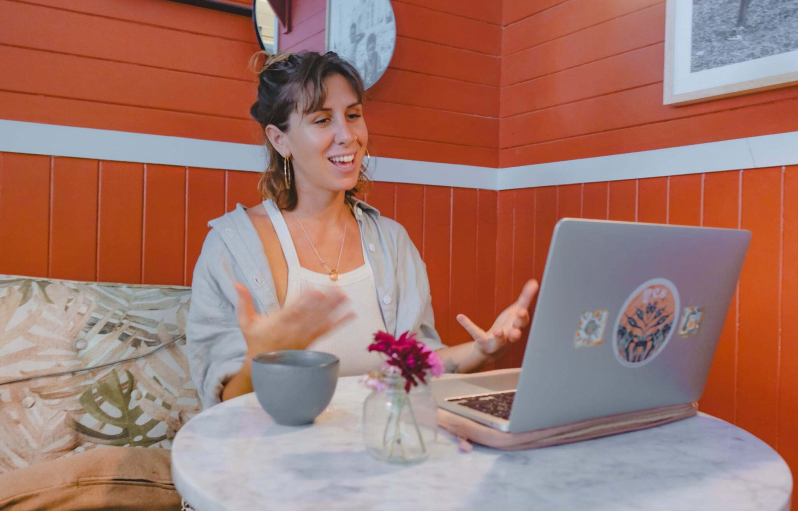

<!-- Le contenu éditorial est découpé dans src/components/pages/masterclass-{intro,outro}.md
     et la grille produits dans src/components/sections/ProductsGrid.astro (page masterclass.astro). -->

Psychologie en ligne

# Les Masterclass

## TON ACCÈS À DU CONTENU EXCLUSIF SUR LA PLEINE CONSCIENCE, LA SEXUALITÉ, LE SYSTÈME NERVEUX.

Cette partie de mon offre est **le cours de psycho-éducation que vous n'avez jamais reçu**. Nous apprenons bien trop peu sur notre psychologie, notre système nerveux et notre sexualité, etc, à l'école.  
Il existe des connaissances essentielles pour mieux nous comprendre :

**Comprendre nos schémas de fonctionnement**,

**Nos besoins en tant qu'êtres humains**,

**Notre mémoire, nos traumatismes**.  
  
Ici, je suis ravie de partager avec vous ce que je considère comme essentiel pour vous accepter et vivre en harmonie avec vous-même. Ce sont des pratiques, des techniques et des explorations intérieures que vous pouvez suivre chez vous, à votre rythme.  
  
J'ai à cœur de vous transmettre les enseignements qui m'aident et aident mes patients à cheminer vers une vie plus harmonieuse.

## Masterclass et programmes

## Des questions ?

Vous pouvez me contacter par [email](<mailto: donetbenedicte@gmail.com>) ou via le [lien de contact](/infos-pratiques/#form) pour me poser vos questions et avoir un premier échange avant de décider de réserver votre masterclass ou programme. Je vous répondrai dans les plus brefs délais.

[Je réserve ma masterclass](#masterclass)
