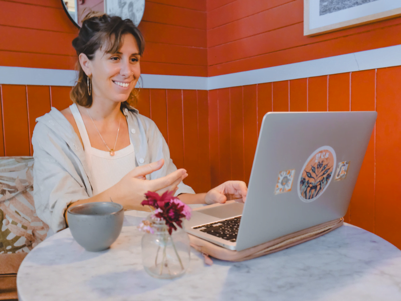

# ONLINE PSYCHOLOGIST

## MY SERVICES

My specialities:

-   Trauma
-   Sexuality (trauma, addictions…)
-   EMDR practice
-   Psycho-corporeal practices

## I support you through various tools

Whether through individual sessions, programmes, workshops or phototherapy, the heart of therapeutic work **rests on kindness, welcome and the integration of your lived experience**.  
Together, we explore every facet of your being: beliefs, tensions, blockages, emotions, in order to grasp and support what is ready to evolve.

The nature of therapy can evolve because each person is unique, requiring specific methods and approaches.

[Book my session](https://www.doctolib.fr/psychologue/l-etang-sale/benedicte-donet?fbclid=IwZXh0bgNhZW0CMTAAAR1i9xzKjnpEu4CYAdKrMjOT29-pjttCgck6O0WvVdrZELEQWLEK59NJcnw_aem_AbGEMI5CdusHS4yKDj6GJEo_APfV_1INRdpW1Bs_gRwVQEzXL8cXo6BsdC98g6Rq2LZMFWFqn1TYoTsTeAiwPWGz)

## PSYCHOTHERAPY

The main modalities I use in my sessions are:

-   **Speech and listening**, the necessary foundation for understanding your experiences, your emotions and your needs.
-   **EMDR**: Eye movement therapy allowing the treatment and resolution of past traumas, facilitating the digestion of memories and reducing their emotional impact.
-   **IEMT**: a therapy technique that explores the question of how we learned to feel in a certain way and opens the possibility of creating appropriate changes in our emotional life.
-   **IFS**: internal family systems, a technique inviting us to welcome the different identities we carry within us, helping them to grow if necessary, to evolve and to regain a sense of safety.
-   **Mindfulness**: meditation, observation of emotions and sensations.
-   **Emotional release techniques** through breathing and the use of the voice.

[Find out more](/en/psychotherapie/)

## Photo-therapy

In these sessions, through phototherapy, I guide you to discover your relationship with the different facets that coexist within you. Those that wish to be seen, those that hide, those that hate themselves, those that love themselves.  
This exercise offers a specific moment and environment to **cultivate self-esteem and tenderly welcome what asks to be brought into the light and felt**.  
  
Through phototherapy, you have the opportunity to explore the different dimensions at play.

[Find out more](/en/phototherapie/)

## Masterclass

Through a variety of online programmes and workshops, I offer teachings and practices that can bring about significant transformations.  
Everything I share in these formats represents knowledge I consider essential for **achieving harmony with our own being**. Understanding ourselves, our inner mechanisms, is a prerequisite for fully welcoming ourselves and living in greater harmony.  
It is with joy that I share what I have acquired over many years of practice and research in my areas of expertise such as trauma, nervous system regulation, sexuality, online meditation and psycho-corporeal practices.

[Find out more](/en/masterclass/)

You think you are the wound, in reality you are the medicine that heals it. You think you are the lock on your heart, in reality you are the key that opens it.

Rumi

## Frequently asked questions

Am I the right psychologist for you?

I invite you to browse my site and take the time to sense whether my approach may suit you. There are so many ways to provide support. My approach is holistic and committed. Any questions to clarify a point about my practice and therapeutic framework are welcome by private message.

What is the recommended frequency for sessions?

We discuss this during our first session, but the final choice will depend on your capacity to receive, the time needed to integrate each session, and your wishes. We are all different and we all have very different rhythms and needs. Our sessions therefore adapt to your sensitivity.

Why do sessions last 1 hour 30?

It is important to me to offer you a space and time that is sufficiently spacious to feel, settle in and share. The space of care is, in my view, a space to protect from a need or desire to rush.  
The body and mind have their own wisdom; like nature, they sometimes move quickly and sometimes slowly.  
Thus, we can take the time that meeting your inner world requires.

What space do I offer?

As an online psychologist, in my support I like to create a welcoming environment by offering you a kind and serene listening. I therefore commit to being resourced, present and available at your side during each of our sessions. For this, I make it a priority to plan intervals between each session I offer. I organise my schedule in a way that offers you the best of my capacity for presence and listening.
