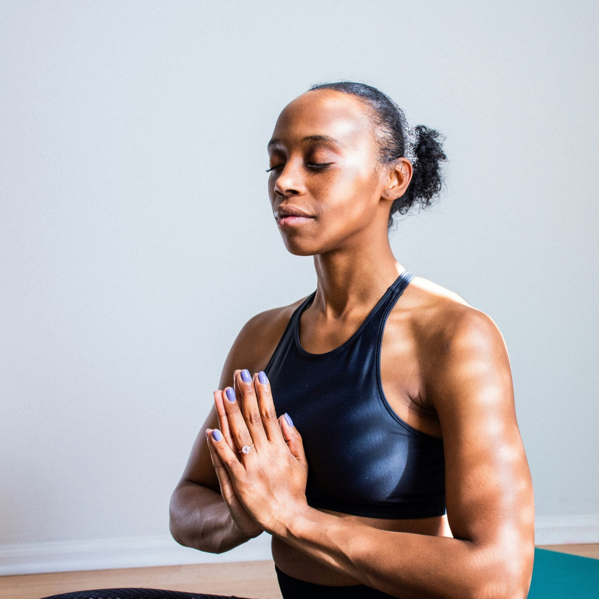

# PSYCHOLOGUE EN VISIO

## MES SERVICES

Mes spécialités :

-   Le traumatisme
-   La sexualité (trauma, addictions…)
-   La pratique de l’Emdr
-   Pratiques psycho-corporelles

## Je vous accompagne à travers divers outils

Qu’il s’agisse de séances individuelles, de programmes, d’ateliers ou de la photothérapie, le cœur du travail thérapeutique **repose sur la bienveillance, l’accueil et l’intégration de votre vécu**.  
Ensemble, nous explorons chaque facette de votre être : croyances, tensions, blocages, émotions, afin de saisir et de soutenir ce qui est prêt à évoluer.

La nature de la thérapie peut évoluer car chacun est unique, nécessitant des méthodes et des approches spécifiques.

[Je réserve ma séance](https://www.doctolib.fr/psychologue/l-etang-sale/benedicte-donet?fbclid=IwZXh0bgNhZW0CMTAAAR1i9xzKjnpEu4CYAdKrMjOT29-pjttCgck6O0WvVdrZELEQWLEK59NJcnw_aem_AbGEMI5CdusHS4yKDj6GJEo_APfV_1INRdpW1Bs_gRwVQEzXL8cXo6BsdC98g6Rq2LZMFWFqn1TYoTsTeAiwPWGz)

## PSYCHOTHÉRAPIE

Les principales modalités que j’utilise dans mes séances sont :

-   **La parole et l’écoute**, socle nécessaire pour comprendre vos expériences, vos émotions et vos besoins.
-   **L’EMDR** : Thérapie par le mouvement oculaire permettant le traitement et la résolution des traumatismes passés, en facilitant la digestion des souvenirs et en réduisant leur impact émotionnel.
-   **L’IEMT** : une technique de thérapie qui explore la question de savoir comment nous avons appris à ressentir d’une certaine manière et ouvre la possibilité de créer des changements appropriés dans notre vie émotionnelle.
-   **L’IFS** : système de famille interne, une technique invitant à accueillir les différentes identités que nous portons en nous, en les aidant à grandir si nécessaire, à évoluer et à retrouver un sentiment de sécurité.
-   **La pleine conscience** : méditation, observation des émotions et sensations.
-   **Les techniques de libération émotionnelle** par la respiration et l’utilisation de la voix.

[En savoir plus](/psychotherapie/)

## Photo-thérapie

Dans ces séances, à travers la photothérapie, je vous guide pour découvrir votre relation avec les différentes facettes qui coexistent en vous. Celles qui désirent être vues, celles qui se cachent, celles qui se détestent, celles qui s’aiment.  
Cet exercice offre un moment et un environnement spécifiques pour **cultiver l’estime de soi et accueillir avec tendresse ce qui demande à être éclairé et ressenti**.  
  
À travers la photothérapie, vous avez l’opportunité d’explorer les différentes dimensions en jeu.

[En savoir plus](/phototherapie/)

## Masterclass

À travers une diversité de programmes et d’ateliers en ligne, je vous propose des enseignements et des pratiques qui peuvent opérer des transformations significatives.  
Tout ce que je partage dans ces formats représente des connaissances que je considère comme essentielles pour **atteindre une harmonie avec notre propre être**. La compréhension de nous-mêmes, de nos mécanismes internes, est un prérequis pour nous accueillir pleinement et vivre en plus grande harmonie.  
C’est avec joie que je partage ce que j’ai acquis au fil de nombreuses années de pratique et de recherche dans mes domaines d’expertise tels que le traumatisme, la régulation du système nerveux, la sexualité, la méditation en ligne et les pratiques psycho-corporelles.

[En savoir plus](/masterclass/)

Vous pensez être la peine, en réalité vous êtes le médicament qui la guérit. Vous pensez être la serrure de votre cœur, en réalité vous êtes la clé qui l’ouvre.

Rûmi

## La foire aux questions

Suis-je la bonne psychologue pour vous ?

Je vous invite à parcourir mon site et prendre le temps de sentir si mon approche peut vous convenir. Il y a tant de manières d’accompagner. Mon approche est holistique et engagée. Toutes questions pour préciser un point de ma pratique et de mon cadre thérapeutique sont bienvenues par message privé.

Quelle est la régularité conseillée pour les séances ?

Nous en discutons lors de notre première séance, mais le choix final dépendra de votre capacité à recevoir, du temps nécessaire pour intégrer chaque séance, de vos envies. Nous sommes tous différents et nous avons tous un rythme et des besoins bien différents. Nos séances s'adaptent donc à votre sensibilité.

Pourquoi les séances durent 1 h 30 ?

Il m’est important de vous offrir un espace et un temps suffisamment spacieux pour sentir, se déposer, partager. L’espace de soin est, à mon sens, un espace à protéger d’un besoin ou d’une envie de précipiter.  
Le corps et l’esprit ont leurs propres sagesses, comme la nature, ils vont parfois vite et parfois lentement.  
Ainsi, nous pouvons prendre le temps que requiert la rencontre avec votre monde intérieur.

Quel espace je propose ?

En tant que psychologue en visio, dans mon accompagnement, j'aime créer un environnement accueillant en vous offrant une écoute bienveillante et sereine. Je m'engage donc à être ressourcée, présente et disponible à vos côtés lors de chacune de nos séances. Pour cela, j'ai à cœur de prévoir des intervalles entre chaque séance que je propose. J'organise mon emploi du temps de manière à vous offrir le meilleur de ma capacité de présence et d'écoute.

## Le journal

#### [Éloge de la présence : l’acte complètement fou d’habiter son corps](/habiter-son-corps/)

-   04/06/2026
-   [Pleine conscience](/category/pleine-conscience/), [Trauma](/category/trauma/)

#### [Exploration de croyance: Un état de paix continue est-il vraiment impossible ?](/exploration-de-croyance-un-etat-de-paix-continue-est-il-vraiment-impossible/)

J’ai longtemps cru que le bonheur demandait des efforts. Qu’il fallait travailler sur soi, se transformer, se réparer presque, pour accéder à un état de paix intérieure plus stable, plus continu. Derrière cela, une croyance silencieuse mais profondément ancrée : la paix ne serait pas notre état naturel, mais quelque chose à atteindre, à construire, à mériter… au prix d’un travail exigeant.

-   17/04/2026
-   [EMDR](/category/emdr/), [Pleine conscience](/category/pleine-conscience/), [Psycho](/category/psycho/), [Psychologie positive](/category/psychologie-positive/), [Trauma](/category/trauma/)

#### [L’EMDR : un processus naturel, pas une solution magique](/emdr-traitement-trauma-processus-naturel/)

L’EMDR respecte profondément le fonctionnement naturel du cerveau. Il n’impose rien. Il ne force pas les souvenirs. Il n’efface pas l’histoire. Il ne prend pas le contrôle. Contrairement à certaines idées reçues, l’EMDR n’est pas une technique « magique » qui ferait disparaître le traumatisme. Il s’agit d’un processus neuropsychologique naturel, qui remet en mouvement les mécanismes innés de traitement de l’information.

-   28/12/2025
-   [EMDR](/category/emdr/), [Psycho](/category/psycho/), [Trauma](/category/trauma/)

#### [Qu’est-ce que la thérapie EMDR ?](/therapie-emdr/)

Vous traversez une période difficile, ou portez en vous un vécu douloureux qui semble encore peser ? L’EMDR (Eye Movement Desensitization and Reprocessing) est une méthode thérapeutique reconnue qui permet de traiter les traumatismes psychiques en profondeur. Dans cet article, découvrez comment cette approche douce et puissante peut vous aider à retrouver plus de légèreté et de sécurité intérieure, à votre rythme.

-   20/05/2025
-   [EMDR](/category/emdr/), [Psycho](/category/psycho/), [Trauma](/category/trauma/)

#### [Traumatisme et relation amoureuse : comprendre l’impact pour mieux guérir](/traumatisme-relation-amoureuse/)

Les traumatismes laissent une empreinte durable sur la psyché humaine, influençant non seulement notre bien-être individuel mais également nos relations intimes. En tant que psychologue clinicienne, j’ai souvent observé comment les traumatismes peuvent tisser des fils invisibles dans le tissu des relations amoureuses. Dans cet article, nous explorerons la manière dont les traumatismes peuvent influencer ces relations, les défis qui en découlent, et comment une compréhension approfondie peut guider vers une guérison individuelle et relationnelle.

-   30/01/2024
-   [Psycho](/category/psycho/), [Trauma](/category/trauma/)

#### [Mémoire et traumatisme : comprendre leur lien pour mieux guérir](/memoire-traumatisme-guerison/)

La mémoire est un mécanisme complexe qui façonne notre compréhension du monde et influence notre comportement.

-   27/01/2024
-   [EMDR](/category/emdr/), [Psycho](/category/psycho/), [Trauma](/category/trauma/)

#### [Dissociation et reconnexion : comment la méditation peut aider](/dissociation-comprendre-le-lien-avec-la-meditation/)

La dissociation, un phénomène complexe qui peut affecter la santé mentale, est souvent méconnue du grand public. En tant que psychologue, je m’intéresse particulièrement à la façon dont la méditation peut jouer un rôle essentiel dans le processus de reconnexion pour ceux qui vivent cette expérience. Dans cet article, nous explorerons la dissociation, son impact sur la vie quotidienne, et comment la méditation peut être un outil précieux pour favoriser une reconnexion profonde avec soi-même.

-   25/01/2024
-   [Pleine conscience](/category/pleine-conscience/), [Psycho](/category/psycho/)

#### [Méditation pleine conscience thérapie : une synergie puissante pour le bien-être](/meditation-pleine-conscience-therapie/)

Dans la quête du bien-être mental, la combinaison de la méditation et de la thérapie offre une approche holistique et puissante pour accompagner les individus sur le chemin de la transformation personnelle.

-   23/01/2024
-   [Pleine conscience](/category/pleine-conscience/), [Psycho](/category/psycho/)

#### [OUR RELATIONSHIP WITH MONEY](/en/our-relationship-with-money-therapy/)

Often, when one thinks about working with a psychologist, the idea of addressing one’s relationship with money might not immediately come to mind. However, it’s a topic that affects everyone, every day. How we feel and engage with money speaks volumes about our past experiences, what our parents and grandparents went through in terms of financial abundance or lack.

-   30/10/2023
-   [Positive psychology](/en/category/positive-psychology/), [Psycho-education](/en/category/psycho-education/), [relationshipwithmoney](/en/category/relationshipwithmoney/)

#### [La relation à l’argent : un sujet universel et souvent négligé](/relation-a-l-argent-psychologie/)

Souvent quand on pense a travailler avec un psychologue, on ne pense pas nécessairement a y aller pour travailler sur sa relation a l’argent. Et pourtant, c’est un sujet qui touche tout le monde, chaque jour. La manière dont nous nous sentons et entrons en relation avec l’argent dit énormément de ce que nous avons vécu, ce que nos parents et grand parents ont vécu en relation avec l’abondance ou le manque financier.

-   30/10/2023
-   [relational'argent](/category/relationalargent/), [Trauma](/category/trauma/)

